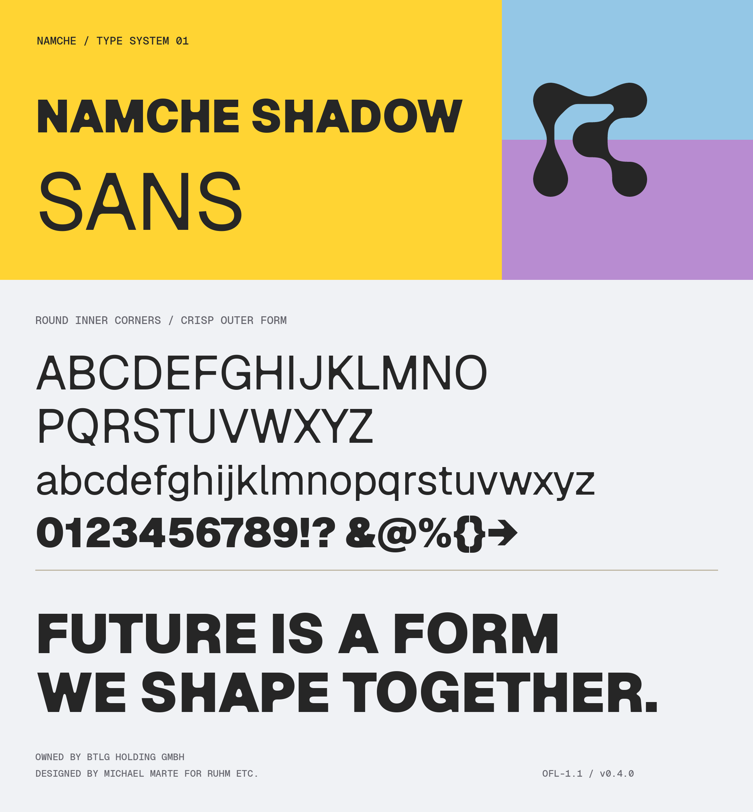

# Namche Shadow

<picture>
  <source media="(prefers-color-scheme: dark)" srcset=".docs/img/namche-shadow-banner--dark.png">
  <source media="(prefers-color-scheme: light)" srcset=".docs/img/namche-shadow-banner--light.png">
  
</picture>

Namche Shadow is a three-family type suite based on
[Vercel's Geist](https://github.com/vercel/geist-font):

| Family | Source | Status |
| --- | --- | --- |
| **Namche Shadow Sans** | Geist Sans | Custom inner-corner treatment designed by Michael Marte |
| **Namche Shadow Mono** | Geist Mono | Identical outlines and metrics; renamed for future Namche-specific work |
| **Namche Shadow Pixel** | Geist Pixel | Geist-derived geometry with focused, reviewed additions |

The repository follows the upstream Geist font-project layout: buildable
sources are in `sources/`, generated releases are in `fonts/`, automation is
in `.github/workflows/`, and the Next.js package is in `packages/next/`.

## Building

Fonts are built and tested by GitHub Actions. To run the same workflow
locally:

```sh
make build
make test
make proof
```

The current Fontspector baseline and triage guidance are documented in
[`documentation/FONTSPECTOR.md`](documentation/FONTSPECTOR.md).
The supported-script contract and intentional auxiliary omissions are listed in
[`documentation/LANGUAGE_SUPPORT.md`](documentation/LANGUAGE_SUPPORT.md).

The Namche Shadow Sans RoundCorner workflow still requires Glyphs for final design
exports. See [`scripts/NAMCHE_SHADOW.md`](scripts/NAMCHE_SHADOW.md) and
[`LEARNINGS.md`](LEARNINGS.md) before producing a release.

## Repository layout

| Path | Purpose |
| --- | --- |
| `sources/` | Namche-named Glyphs sources and gftools builder configs |
| `fonts/` | OTF, TTF, and WOFF2 distributions; variable builds where release-ready |
| `originals/geist/` | Immutable safecopy of the original Geist sources |
| `scripts/` | Upstream build helpers and Namche Shadow Sans design tooling |
| `packages/next/` | Next.js package, adapted from the upstream package |
| [`documentation/`](documentation/README.md) | QA policy, reviewed proofs, release text, and project history |

The original archive must not be edited. Its provenance is documented in
[`originals/geist/UPSTREAM.md`](originals/geist/UPSTREAM.md).

The npm release workflow uses token-free OIDC publishing. Its configuration
and recovery notes are documented in
[`documentation/TRUSTED_PUBLISHING.md`](documentation/TRUSTED_PUBLISHING.md).

## Using the fonts

Choose the delivery path that matches the project’s deployment model.

### CDN URL: zero install

Import a versioned stylesheet directly when the project should ship no font
binaries and does not need an npm dependency:

```css
@import url("https://cdn.namche.ai/fonts/namche-shadow/v0.2.1/fonts.css");
```

This is one import, uses an immutable versioned stylesheet URL that survives
downstream redeploys, and serves font files from the CDN edge. Its internal
font URLs are relative to the version root, so the same stylesheet bytes work
for every release tag while still resolving within the selected version. The
version is explicit; upgrading means changing it in the import.

### npm with CDN delivery: one package update

Install `@namche/namche-shadow`, then import its CDN-pinned entry point:

```css
@import "@namche/namche-shadow/fonts.cdn.css";
```

The stylesheet is generated from the package’s own version, so `npm update`
repoints all font URLs to that matching immutable CDN release. The build does
not copy font binaries to the app’s own origin. Family-only alternatives are
`sans.cdn.css`, `mono.cdn.css`, `pixel.cdn.css`, and `geist.cdn.css`.

### npm with self-hosting: offline and air-gapped

Framework-agnostic apps—including Astro, Vite, and plain CSS builds—can instead
load all three families from package-relative files:

```css
@import "@namche/namche-shadow/fonts.css";
```

Import only the families an app uses to avoid loading unnecessary faces:

```css
@import "@namche/namche-shadow/sans.css";
@import "@namche/namche-shadow/mono.css";
@import "@namche/namche-shadow/pixel.css";
```

Namche-controlled properties that only render the maintained Latin web set can
use the smaller opt-in entry points:

```css
@import "@namche/namche-shadow/sans-latin.css";
@import "@namche/namche-shadow/mono-latin.css";
```

CDN-backed equivalents end in `-latin.cdn.css`; direct releases expose
`fonts-latin.css` and the corresponding family-only stylesheets. Keep the
unsuffixed full entry points for user-generated text, multilingual content,
font specimens, or Mono interfaces that need Cyrillic, box drawing, and
technical symbols. Every Latin `@font-face` has a matching `unicode-range`,
and its WOFF2 file is also physically subsetted.

This fully self-hosted path bundles the required WOFF2 files, works offline or
in an air-gapped deployment, and makes the downstream origin responsible for
serving them.

All CSS entry points expose `Namche Shadow Sans`, `Namche Shadow Mono`, the
five Pixel variant families (`Namche Shadow Pixel Square`, `Grid`, `Circle`,
`Triangle`, and `Line`), and upstream `Geist`.

### Upstream Geist for body text

Namche applications use [Vercel's Geist](https://vercel.com/font) for body
text, and Vercel publishes it on npm but not on a CDN. The release therefore
bundles the upstream Geist Sans variable faces byte for byte and serves them
from the same CDN release and npm package, so one `fonts.css` (or
`fonts-latin.css`) import covers body text and the Namche Shadow families
together. Family-only entry points are `geist.css`, `geist-latin.css`, and
their `.cdn.css` equivalents.

`fonts/Geist` is a verbatim copy of the binaries from the
[`geist`](https://www.npmjs.com/package/geist) npm package pinned in
[`sources/geist-upstream.json`](sources/geist-upstream.json); CI re-downloads
the pinned tarball and byte-compares on every pull request. Update it with
`make update-geist` after bumping the pin. Geist Mono and Geist Pixel are not
bundled: Namche Shadow Mono and Pixel are outline-identical renamed
derivatives of those same binaries. Geist is licensed under the same SIL Open
Font License 1.1 with no Reserved Font Name; the upstream license ships as
`Geist/LICENSE.txt` in every release. Next.js apps that want automatic font
optimisation for Geist should keep using Vercel's own `geist` package.

Next.js users should keep using the `next/font/local`
entry points for automatic font optimisation:

```tsx
import { NamcheShadowSans } from "@namche/namche-shadow/font/sans";
import { NamcheShadowMono } from "@namche/namche-shadow/font/mono";
```

For controlled Latin-only Next.js routes, switch the import paths without
renaming the exported font objects:

```tsx
import { NamcheShadowSans } from "@namche/namche-shadow/font/sans-latin";
import { NamcheShadowMono } from "@namche/namche-shadow/font/mono-latin";
```

The complete desktop OTF/TTF files and existing full WOFF2 entry points remain
unchanged. GitHub Actions generates the Latin WOFF2 files deterministically
from those approved full webfonts for npm, release ZIP, and CDN artifacts; the
subset binaries are build outputs rather than committed sources. The shared
codepoint contract is [`sources/subsets/latin.txt`](sources/subsets/latin.txt).

Published releases are mirrored to `https://cdn.namche.ai` through the
infrastructure repository. A versioned URL is immutable and safe to cache
forever. The short-lived
[`current` alias](https://cdn.namche.ai/fonts/namche-shadow/current/fonts.css)
is only a preview pointer and must never be pinned in production.

The CDN benefits are smaller downstream artifacts, one-version-bump
propagation through npm, immutable asset URLs that survive redeploys, and edge
latency. It does not provide cross-site font-cache reuse: modern browsers
partition the HTTP cache by top-level site. Release files, their SHA-256
manifest, and the available-version index share the
`https://cdn.namche.ai/fonts/namche-shadow/` prefix. A successful tagged GitHub
release dispatches the approved archive to the CDN origin automatically; the
font repository never holds origin or SSH credentials.

### Static and variable fonts

Namche Shadow Sans ships static Thin through Black weights plus a `wght`
variable font pair, upright and italic. The approved static exports remain
the visual source of truth. The default and `font/sans` npm entry points use
both rounded VFs with static fallbacks; `font/sans-non-variable` uses statics
throughout. Five glyphs whose rounded masters still differ are parked only
from the VFs and remain present in every static.

Namche Shadow Mono and Namche Shadow Pixel retain their upstream-derived
variable builds.

## Credits

The Namche Shadow Sans design direction and implementation is done by
[Michael Marte](https://github.com/fizzybubbele) for
[Ruhm etc.](https://ruhmetc.com/).

The suite is derived from Geist, created by Vercel in collaboration with
Basement Studio, Andrés Briganti, Mateo Zaragoza, and the other contributors
listed in [`AUTHORS.txt`](AUTHORS.txt) and [`CONTRIBUTORS.txt`](CONTRIBUTORS.txt).
Namche Shadow Mono preserves its upstream outlines exactly. Namche Shadow Pixel
retains Geist Pixel's geometry while accepting only focused, reviewed glyph
additions and shaping corrections; its new name does not imply a wholesale
redesign.

## License

The fonts, sources, and derivative font work are licensed under the
[SIL Open Font License 1.1](OFL.txt). Original Geist copyright notices and
author credits are retained in the sources and binary font metadata.
